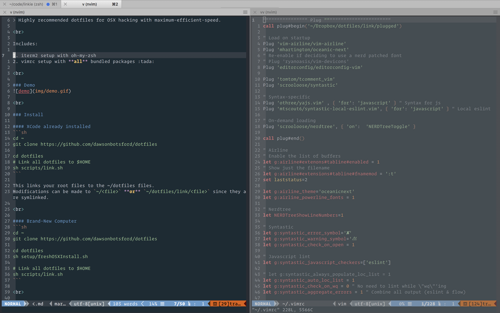

> Dotfiles for ⚡️-fast hacking

## Install

```sh
cd ~/Dropbox
git clone https://github.com/dawsonbotsford/dotfiles
./dotfiles/scripts/bootstrap.sh
```

<br />

This assumes you have the following:

1. MacOS
2. [iTerm2](https://www.iterm2.com/) (instead of the default MacOS Terminal)
3. zsh (instead of the default bash)
4. [Operator Mono Font](https://www.typography.com/blog/introducing-operator). Change the following line in [`link/vimrc`](link/vimrc) if you want to use a different *italics friendly* font
```sh
set guifont=Operator\ Mono:h14 " Custom font.
```
4. Dropbox located in `$HOME/Dropbox`

🎁 You'll get:

1. A beautiful terminal thanks to zsh & oh-my-zsh 💁
2. A [Neovim](https://neovim.io/) setup similar to a well equipped IDE 💅
3. A packaged vimrc with linting & syntax highlighting from the get-go 🎨
4. A bootstrap script to get setup quickly ⚡️



## More Information

* Modifications can be made to either `~/<file>` **or** `~/Dropbox/dotfiles/link/<file>` since they are symlinked.

### Bootstrap Script

🔗 The first thing the bootstrap script does is symlink files from `./link/*` to `$HOME`:

* `./link/zshrc` -> `$HOME/.zshrc`
* `./link/gitignore` -> `$HOME/.gitignore`
* `./link/vimrc` -> `$HOME/.config/nvim/init.vim`
* `./link/en.utf-8.add` -> `$HOME/.config/nvim/spell/en.utf-8.add`

👩‍⚕️ After this, the bootstrap script attempts to doctor your system to ensure you have necessary prerequisites (like python3 or an italic iTerm2 `terminal` in the settings). Warnings are logged to the console to help you get the proper prerequisites.

## Fresh OSX Instructions

* Go Install node 
* Run bootstrap

## License

MIT © [Dawson Botsford](https://dawsbot.com)
